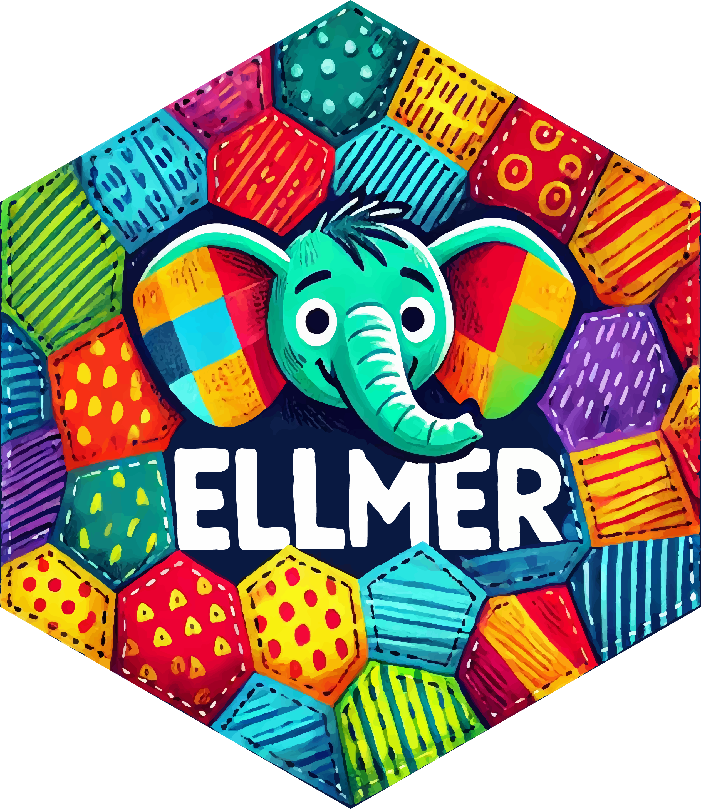
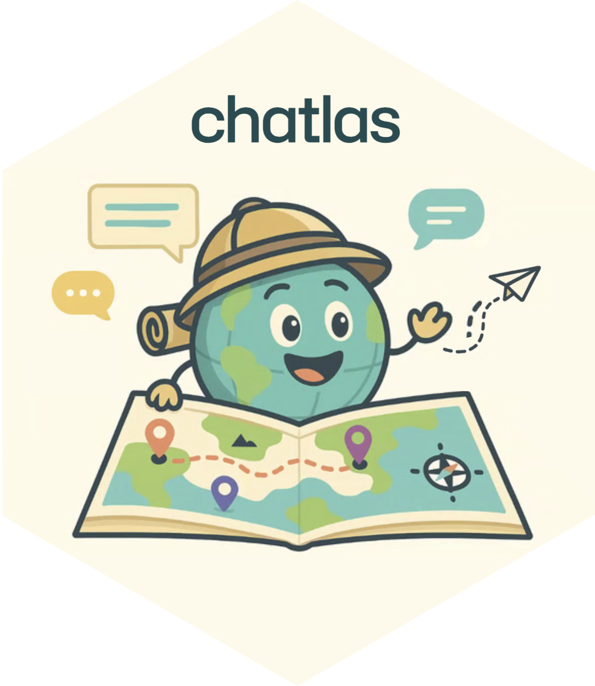
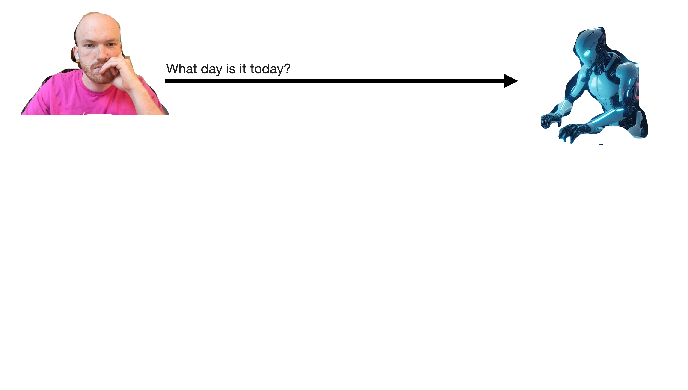
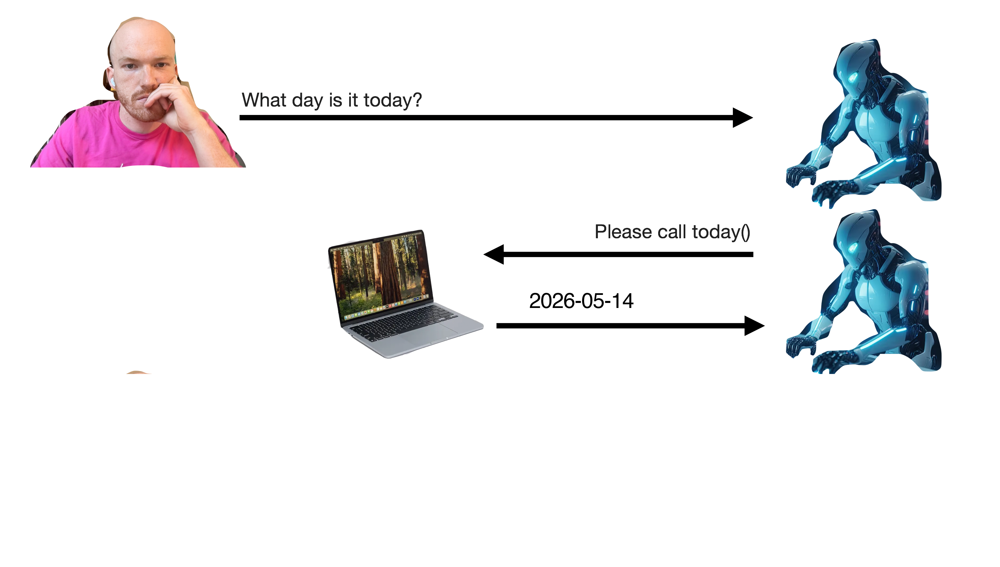
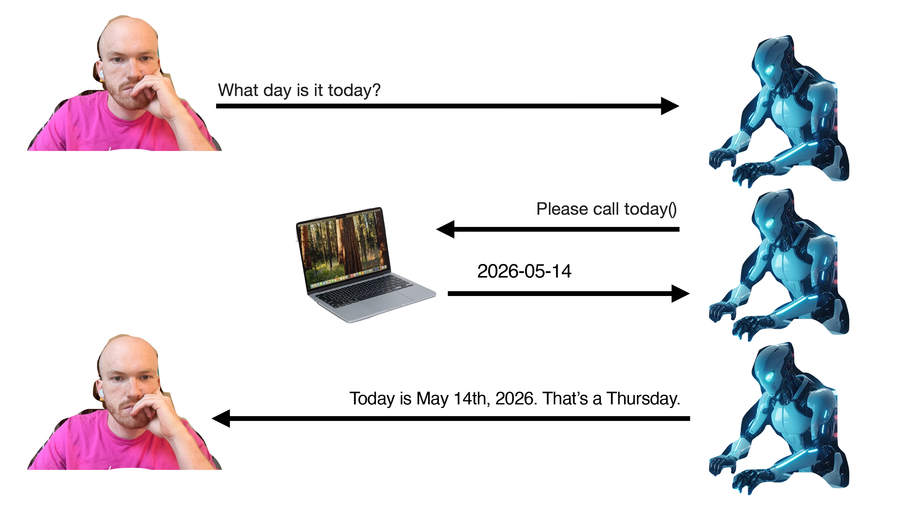
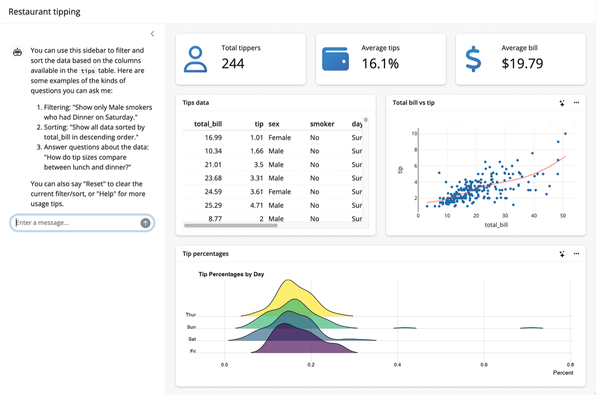
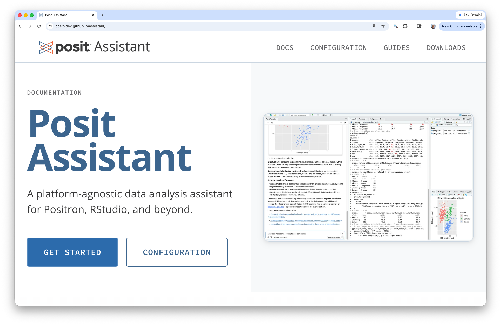
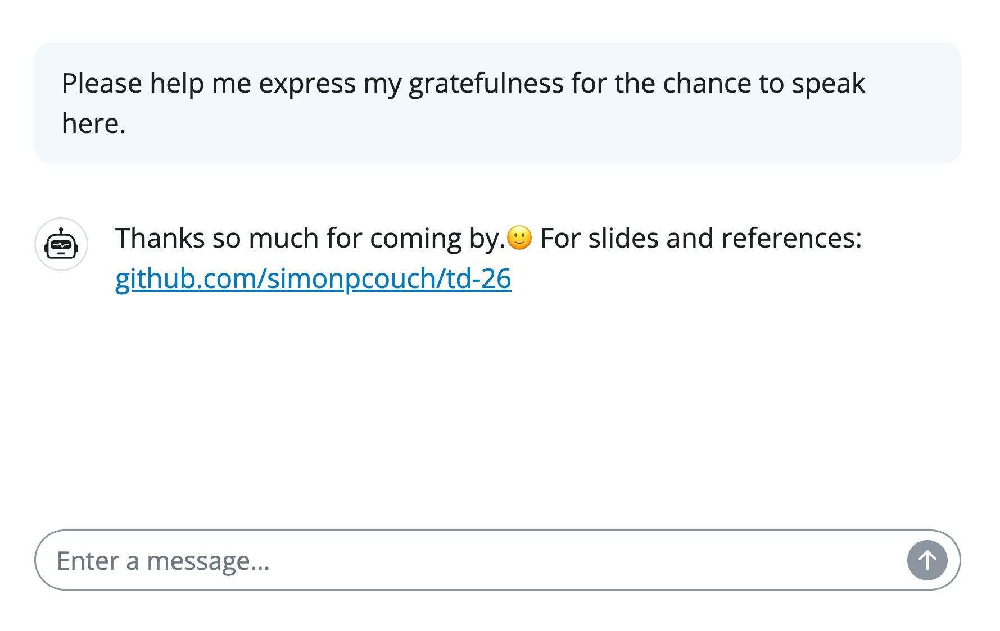

<span style="color:#447099; font-size:270%; font-weight:bold;">Practical AI for Data Science</span> <a href="https://simonpcouch.github.io/chores/"></a>

<br><br><br>

<span style="color:#447099">_Simon Couch_ - @simonpcouch</span>

<span style="color:#447099">AI Core Team @ Posit</span>

## Median LinkedIn post (2026)

. . .

<!-- I think there's a third missing thing here, which is that data science work is a lot of mundane tabularizing + coding + integrating sources. -->

:::::: {.columns}
::: {.column width="50%"}

:::
::: {.column width="5%"}
:::
::: {.column width="45%"}
::: {style="background-color: #e8e8e8ff; padding: 20px; border-radius: 15px; box-shadow: 0 4px 12px rgba(0, 0, 0, 0.15);"}
<span style="font-size: 0.6em;">AI will change EVERYTHING about data science. Hear me out...👇</span>

<span style="font-size: 0.6em; color: #888; text-align: right; display: block;">Click to expand</span>

{width="100%" fig-alt="A humanoid robot typing on a laptop in a control room."}
:::
:::
::::::

## Median LinkedIn post (2026)

:::::: {.columns}
::: {.column width="50%"}
In AI discourse:

:::incremental
* Robots (LLM API keys) are free / happily paid for by someone else
* The Data being Scienced can happily be sent straight to OpenAI's servers
* Data science can be "one-shotted"
:::
:::
::: {.column width="5%"}
:::
::: {.column width="45%"}
::: {style="background-color: #e8e8e8ff; padding: 20px; border-radius: 15px; box-shadow: 0 4px 12px rgba(0, 0, 0, 0.15);"}
<span style="font-size: 0.6em;">AI will change EVERYTHING about data science. Hear me out...👇</span>

<span style="font-size: 0.6em; color: #888; text-align: right; display: block;">Click to expand</span>

{width="100%" fig-alt="A humanoid robot typing on a laptop in a control room."}
:::
:::
::::::

## LinkedIn vs. reality

:::::: {.columns}

::: {.column width="50%"}
In AI discourse:

* Robots (LLM API keys) are free / happily paid for by someone else
* The Data being Scienced can happily be sent straight to OpenAI's servers
* Data science can be "one-shotted"
:::

::: {.column width="5%"}
:::

::: {.column width="45%"}
In reality:

:::incremental
* Frontier LLMs cost money
* Data science happens on mostly sensitive / confidential data
* Data science is messy, subtle, and context-rich
:::
:::

::::::


##

<br>
I want to:

* Show you **what's possible via LLM APIs**
* Help you imagine **making it work in practice**

# What's possible via APIs {background-color=#447099}

## Talk to LLMs via APIs

Web vs. API:

* Web: [chatgpt.com](chat.com), [claude.ai](claude.ai), other "chat interfaces"
* API: Using Python, R, etc. with an API key

## Talk to LLMs via APIs

{.absolute height="250px" right="0" top="20" fig-alt="The ellmer hex sticker, a colorful elephant in a patchwork of fabrics."}

{.absolute height="250px" right="225px" top="20" style="filter: drop-shadow(0 2px 4px rgba(0, 0, 0, 0.15));" fig-alt="The chatlas hex sticker."}

<br>

::: {style="display: flex; flex-direction: column; align-items: flex-start; gap: 20px; margin-top: 20px;"}

::: {.fragment style="background-color: #f18760; padding: 12px 24px; border-radius: 10px; box-shadow: 0 4px 8px rgba(0, 0, 0, 0.15); text-align: left; width: 480px;"}
<span style="color: white; font-size: 1.08em; font-weight: bold;">1. Structured data</span>
:::

::: {.fragment style="background-color: #6390b3; padding: 12px 24px; border-radius: 10px; box-shadow: 0 4px 8px rgba(0, 0, 0, 0.15); text-align: left; width: 480px;"}
<span style="color: white; font-size: 1.08em; font-weight: bold;">2. Tool calling</span>
:::

::: {.fragment style="background-color: #faedc7; padding: 12px 24px; border-radius: 10px; box-shadow: 0 4px 8px rgba(0, 0, 0, 0.15); text-align: left; width: 480px;"}
<span style="color: #447099; font-size: 1.08em; font-weight: bold;">3. Coding agents</span>
:::
:::

## Talk to LLMs via APIs

```{r}
#| eval: false
library(ellmer)

chat <- chat_anthropic()

chat$chat("Who are you?")
#> Using model = "claude-sonnet-4-6".
#> 
#> I'm Claude, an AI assistant created by Anthropic. I'm here to help
#> with a wide variety of tasks like answering questions, helping with
#> analysis and research, creative writing, math and coding problems,
#> and having conversations. Is there something specific I can help
#> you with today?
```

{.absolute height="250px" right="0" top="20" fig-alt="The ellmer hex sticker, a colorful elephant in a patchwork of fabrics."}

# [Structured data]{style="color: white;"} {background-color=#f18760}

::: footer
<span style="color:#447099;">github.com/simonpcouch/td-26</span>
:::

## Structured data

<!-- Your turn -->

```{r}
#| eval: false
# How would you extract name and age from this data?

prompts <- list(
  "I go by Alex. 42 years on this planet and counting.",
  "Pleased to meet you! I'm Jamal, age 27.",
  "They call me Li Wei. Nineteen years young.",
  "Fatima here. Just celebrated my 35th birthday last week.",
  "The name's Robert - 51 years old and proud of it.",
  "Kwame here - just hit the big 5-0 this year."
)
```

## Structured data

<!-- LLMs are generally good at this sort of task -->

```{r}
#| eval: false
chat <- chat_anthropic()
chat$chat("Extract the name and age from each sentence I give you")
chat$chat(prompts[[1]])
#> **Name:** Alex
#> **Age:** 42
chat$chat(prompts[[2]])
#> **Name:** Jamal
#> **Age:** 27
chat$chat(prompts[[3]])
#> **Name:** Li Wei
#> **Age:** 19
```

## Structured data

<!-- But wouldn't it be nice to get an R data structure? -->

```{r}
#| eval: false
chat$chat(prompts[[3]])
#> list(
#>   name = "Li Wei",
#>   age = 19
#> )
```

## Structured data

<!-- Well you can 😀 -->

```{r}
#| eval: false
type_person <- type_object(
  name = type_string(),
  age = type_number()
)

chat$chat_structured(prompts[[1]], type = type_person)
#> List of 2
#>  $ name: chr "Alex"
#>  $ age : int 42
```

# [Structured data]{style="color: white;"} {background-color=#f18760}

::: footer
<span style="color:#447099;">github.com/simonpcouch/td-26</span>
:::

# [Tool calling]{style="color: white;"} {background-color=#6390b3}

## Tool calling

<!-- LLMs don't have access to live data about the world -->

```{r}
#| eval: false
chat <- chat_anthropic()
chat$chat("What day is it today?")
#> I don't have access to real-time information, so I can't
#> tell you what day it is today. You can check your device's
#> calendar or clock for the current date.
```

## Tool calling

<!-- A tool is just a function with some extra metadata -->


```{r}
#| eval: false
today <- tool(
  function() Sys.Date(),
  name = "today",
  description = "Get today's date",
  arguments = list()
)
chat$register_tool(today)
```

## Tool calling

<!-- Now the model can know what day it is -->

```{r}
#| eval: false
chat$chat("What day is it today?")
#> ◯ [tool call] today()
#> ● #> "2026-05-14"
#> Today is May 14th, 2026. That's a Thursday.
```

## Tool calling

{fig-alt="A diagram of the tool calling. At first, the user sends a message to the LLM reading 'What day is it today?'"}

## Tool calling

{fig-alt="A continuation of the previous diagram. Now, the LLM sends a message back to the user that the computer handles automatically, calling the 'today' tool."}

## Tool calling

{fig-alt="A continuation of the previous diagram. Now, once the model has received the current date, it will respond to the user directly, saying 'Today is __'."}

<!-- We can use this to give the LLM traditional computing powers -->

# [Tool calling]{style="color: white;"} {background-color=#6390b3}

# Coding (agents) {background-color=#faedc7}

## Agent = LLM calling tools in a loop

## Coding agents: querychat

Tool: `write_sql_query`

. . .

{fig-alt="A package demo, where a user types a question and a model filters the data underlying a shiny app to show only the data relevant to the question." width="70%" fig-align="center"}

:::footer
<span style="color:#ee6331;">https://posit-dev.github.io/querychat/</span>
:::

## Coding agents: `side::kick()`

Tools: `bash()`, `console()` (like Copilot or Claude Code)

. . .

<video width="100%" controls>
  <source src="figures/sidekick.mp4" type="video/mp4">
</video>

:::footer
<span style="color:#ee6331;">github.com/simonpcouch/side</span>
:::

## Coding agents: Posit Assistant


{fig-alt="A screenshot of the Posit Assistant website. The tag-line reads 'A platform-agnostic data analysis assistant for Positron, RStudio, and beyond.'" fig-align="center"}

:::footer
<span style="color:#ee6331;">pos.it/assistant</span>
:::

# What's possible via APIs {background-color=#447099}


# Making it work in practice {background-color=#447099}

## Raise your hand if...

:::incremental
* Your workplace has some approved, secure deployment of an LLM
* That LLM is frontier(ish): Claude Sonnet 4.5, GPT 5.2
* You're able to access that deployment via a chatbot
* Someone on your team may have figured out how to connect it to an API
:::

## OpenAI API compatible endpoints

. . . 

In R, e.g. `side::kick()`:

```r
formals(chat_openai_compatible)
#> [snip]
#> 
#> $base_url
#> Sys.getenv("OPENAI_BASE_URL", "https://api.openai.com/v1")
#> 
#> $api_key
#> openai_key()
#> 
#> [snip]
#> 
#> $api_headers
#> character()
```

:::footer
<span style="color:#ee6331;">ellmer.tidyverse.org/reference/chat_openai</span>
:::

# Practical AI for data science  {background-color=#447099}

<!-- In 2017, when "AI" was support vector machines, we were big on this "Serious Data Science" idea—despite all the hype, there was some real utility to this technology. We feel the same way, and meeting you where you are in your LLM deployment is part of our approach to "Serious AI". -->

##

{fig-alt="A screenshot of the Posit Open Source Blog with a recent entry of the AI Newsletter. Both are titled with their date and authored by Sara Altman and myself." fig-align="center"}

:::footer
<span style="color:#ee6331;">https://opensource.posit.co/tags/ai-newsletter/</span>
:::

##

{fig-alt="A screenshot of a mock conversation with a chatbot. The user says 'Please help me express my gratefulness for the chance to speak here.' The chat bot then replies 'Thanks so much for coming by.🙂 For slides and references: github.com/simonpcouch/td-26'."}

:::footer
:::
