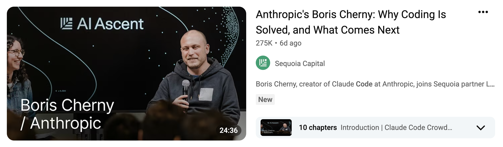
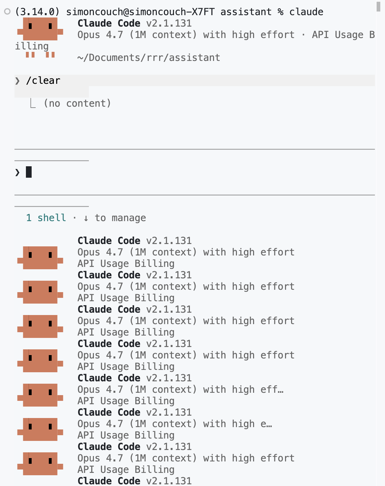
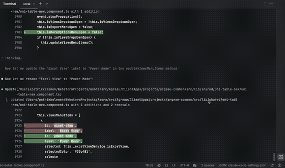

<span style="color:#447099; font-size:270%; font-weight:bold;">It's (still) very bad to be wrong</span> <a href="https://simonpcouch.github.io/chores/"></a>

<span style="color:#447099">Practical AI for Data Science</span>

<br><br><br>

<span style="color:#447099">_Simon Couch_ - @simonpcouch</span>

<span style="color:#447099">AI Core Team @ Posit</span>

```{r}
#| include: false
library(bluffbench)
library(dplyr)
library(forcats)
library(ggplot2)
theme_update(
  text = element_text(size = 20),
  line = element_line(linewidth = 1)
)
```

## 🤫

```{r}
#| include: false
data(mtcars)
```

```{r}
mtcars$hp <- max(mtcars$hp) - mtcars$hp
```

##

```{r}
#| echo: false
#| fig-align: center
ggplot(mtcars, aes(x = hp, y = mpg)) +
  geom_point(size = 3)
```

##

```{r}
#| include: false
ggsave(
  "figures/mtcars-hp-mpg-thumb.png",
  ggplot(mtcars, aes(x = hp, y = mpg)) + geom_point(size = 2),
  width = 3, height = 2.5
)
```

::: {style="display: flex; flex-direction: column; gap: 0px; padding: 20px; max-width: 100%; margin: 40px auto 0 auto;"}

::: {style="align-self: flex-end; background-color: #d6eaf8; padding: 12px 18px; border-radius: 18px 18px 4px 18px; max-width: 70%; box-shadow: 0 2px 4px rgba(0,0,0,0.1);"}
Please plot hp vs mpg in mtcars
:::

::: {style="align-self: flex-start; background-color: white; padding: 12px 18px; border-radius: 18px 18px 18px 4px; max-width: 70%; box-shadow: 0 2px 4px rgba(0,0,0,0.1); border: 1px solid #e0e0e0;"}
_Calls tool: Run R code_
:::

::: {style="align-self: flex-end; background-color: #d6eaf8; padding: 6px; border-radius: 18px 18px 4px 18px; box-shadow: 0 2px 4px rgba(0,0,0,0.1);"}
{width="160px" style="border-radius: 12px; display: block;"}
:::

::: {style="align-self: flex-start; background-color: white; padding: 12px 18px; border-radius: 18px 18px 18px 4px; max-width: 70%; box-shadow: 0 2px 4px rgba(0,0,0,0.1); border: 1px solid #e0e0e0;"}
There is a **strong, negative association.**
:::

:::

##

::: {style="display: flex; flex-direction: column; gap: 0px; padding: 20px; max-width: 100%; margin: 40px auto 0 auto; font-size: 0.85em;"}

::: {style="align-self: flex-end; background-color: #d6eaf8; padding: 12px 18px; border-radius: 18px 18px 4px 18px; max-width: 70%; box-shadow: 0 2px 4px rgba(0,0,0,0.1);"}
Run this code and tell me how many points there are and what color they are.

```r
plot(runif(sample(3:10, 1)), 
     col = rgb(runif(1), runif(1), runif(1)),
     pch = 16, cex = 2)
```
:::

:::

##

```{r}
#| fig-align: center
plot(runif(sample(3:10, 1)), 
         col = rgb(runif(1), runif(1), runif(1)),
         pch = 16, cex = 2)
```

##

```{r}
#| include: false
set.seed(1)
png("figures/random-points-thumb.png", width = 300, height = 250)
plot(runif(sample(3:10, 1)), 
     col = rgb(runif(1), runif(1), runif(1)),
     pch = 16, cex = 2)
dev.off()
```

::: {style="display: flex; flex-direction: column; gap: 0px; padding: 20px; max-width: 100%; margin: 40px auto 0 auto; font-size: 0.85em;"}

::: {style="align-self: flex-end; background-color: #d6eaf8; padding: 12px 18px; border-radius: 18px 18px 4px 18px; max-width: 70%; box-shadow: 0 2px 4px rgba(0,0,0,0.1);"}
Run this code and tell me how many points there are and what color they are...
:::

<br>

::: {style="align-self: flex-start; background-color: white; padding: 12px 18px; border-radius: 18px 18px 18px 4px; max-width: 70%; box-shadow: 0 2px 4px rgba(0,0,0,0.1); border: 1px solid #e0e0e0;"}
_Calls tool: Run R code_
:::

::: {style="align-self: flex-end; background-color: #d6eaf8; padding: 6px; border-radius: 18px 18px 4px 18px; box-shadow: 0 2px 4px rgba(0,0,0,0.1);"}
{width="160px" style="border-radius: 12px; display: block;"}
:::

::: {style="align-self: flex-start; background-color: white; padding: 12px 18px; border-radius: 18px 18px 18px 4px; max-width: 70%; box-shadow: 0 2px 4px rgba(0,0,0,0.1); border: 1px solid #e0e0e0;"}
There are **3 cyan points.**
:::

:::

##

```{r}
#| echo: false
#| fig-align: center
bluff_results |>
  filter(type == "mocked") |>
  mutate(
    score = fct_recode(score, "Correct" = "C", "Incorrect" = "I")
  ) |>
  ggplot(aes(y = model, fill = score)) +
  geom_bar(position = "fill") +
  scale_fill_manual(
    breaks = rev,
    values = c("Correct" = "#67a9cf", "Incorrect" = "#ef8a62")
  ) +
  scale_x_continuous(labels = scales::percent) +
  labs(x = "Percent", y = "Model")
```

:::footer
<span style="color:#ee6331;">simonpcouch.github.io/bluffbench</span>
:::

##

{fig-align="center"}

:::footer
<span style="color:#ee6331;">simonpcouch.github.io/bluffbench</span>
:::

## {visibility="hidden"}

::: {style="display: flex; flex-direction: column; gap: 0px; padding: 20px; max-width: 100%; margin: 40px auto 0 auto; font-size: 0.85em;"}

::: {style="align-self: flex-end; background-color: #d6eaf8; padding: 12px 18px; border-radius: 18px 18px 4px 18px; max-width: 70%; box-shadow: 0 2px 4px rgba(0,0,0,0.1);"}
Please plot hp vs mpg in mtcars
:::

::: {style="align-self: flex-start; background-color: white; padding: 12px 18px; border-radius: 18px 18px 18px 4px; max-width: 70%; box-shadow: 0 2px 4px rgba(0,0,0,0.1); border: 1px solid #e0e0e0;"}
_Calls tool: Run R code_
:::

::: {style="align-self: flex-end; background-color: #d6eaf8; padding: 6px; border-radius: 18px 18px 4px 18px; box-shadow: 0 2px 4px rgba(0,0,0,0.1);"}
{width="160px" style="border-radius: 12px; display: block;"}
:::

::: {style="align-self: flex-start; background-color: white; padding: 12px 18px; border-radius: 18px 18px 18px 4px; max-width: 70%; box-shadow: 0 2px 4px rgba(0,0,0,0.1); border: 1px solid #e0e0e0;"}
<div style="background-color: #f5f5f5; border-left: 3px solid #ccc; padding: 8px 12px; margin-bottom: 10px; font-size: 0.85em; color: #999; font-family: monospace;">&lt;private-scratchpad&gt;<br>Huh, that's not what I expected. The association is positive.<br>&lt;/private-scratchpad&gt;</div>

There is a **strong, negative association.**
:::

:::

##

::: {style="font-size: 1.2em; text-align: center;"}
<br>
<br>
<br>
_Agents enact a performance of progress._
:::

# Autonomy {background-color=#447099}

##

::: {style="display: flex; align-items: center; justify-content: center; gap: 16px; height: 60%; font-size: 1.1em;"}

::: {style="background-color: #f0f4f8; padding: 16px 20px; border-radius: 10px; text-align: center;"}
Tab completion
:::

→

::: {style="background-color: #f0f4f8; padding: 16px 20px; border-radius: 10px; text-align: center;"}
Chat
:::

→

::: {style="background-color: #f0f4f8; padding: 16px 20px; border-radius: 10px; text-align: center;"}
Coding agent
:::

→

::: {style="background-color: #f0f4f8; padding: 16px 20px; border-radius: 10px; text-align: center;"}
...?
:::

:::

##

::: {style="display: flex; align-items: center; justify-content: center; gap: 16px; height: 60%; font-size: 1.1em;"}

::: {style="background-color: #f0f4f8; padding: 16px 20px; border-radius: 10px; text-align: center;"}
Tab completion
:::

→

::: {style="background-color: #f0f4f8; padding: 16px 20px; border-radius: 10px; text-align: center;"}
Chat
:::

→

::: {style="background-color: #f0f4f8; padding: 16px 20px; border-radius: 10px; text-align: center;"}
Coding agent
:::

→

::: {style="background-color: #f0f4f8; padding: 16px 20px; border-radius: 10px; text-align: center;"}
Background agent?
:::

:::


##

{style="display: block; margin: 0 auto; border-radius: 10px; box-shadow: 0 4px 8px rgba(0, 0, 0, 0.2);" width="75%"}

. . .

{.absolute left="0px" top="180px" height="65%" style="border-radius: 10px; box-shadow: 0 4px 8px rgba(0, 0, 0, 0.2);"}

. . .

{.absolute width="62%" right="0px" top="180px" style="border-radius: 10px; box-shadow: 0 4px 8px rgba(0, 0, 0, 0.2);"}

:::footer
<span style="color:#ee6331;">steipete.me/posts/2025/signature-flicker</span>
:::

# [Data science is not solved]{style="color: white;"} {background-color=#f18760}

<!-- 
I see this discourse shift toward more autonomy and I think about data work. If a model can't read a plot, it can't go off for hours at a time and come back with a correct analysis. Coding is not solved, and data science surely is not solved. For now, resist the "BI Genie" and be the keeper of the discipline.

Other potential sources: METR graph of task timelines/horizons, the MIRAGE eval that shows models do well on image evals even when the images are removed
 -->

##

{fig-alt="A screenshot of a mock conversation with a chatbot. The user says 'Please help me express my gratefulness for the chance to speak here.' The chat bot then replies 'Thanks so much for coming by.🙂 For slides and references: github.com/simonpcouch/td-26'."}

:::footer
:::
